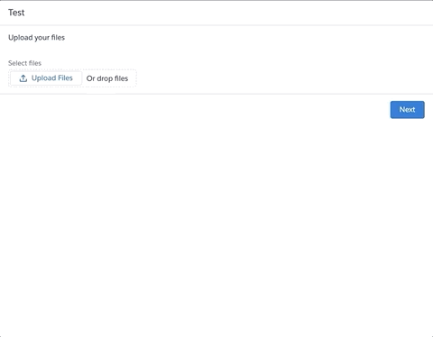

# Lightning File Uploader component for Salesforce Lightning Flow

This file uploader component works exactly the same as the OOB flow component, with a couple enhancements to make it behave more like you'd expect.

* It displays the list of files that have been uploaded so the user knows the upload was successful.
* Allows the uploaded files to be deleted if a mistake was made.
* Enforces the 1 file limit if multiple uploads are not allowed.

## Installation

There are multiple ways to install the component into one of your environments.

#### Scratch org

Click here to install this into a scratch org and try it out.

#### Sandbox

Click here to install the component to your sandbox.

#### Any environment

Use one of these links to install the component as an unlocked package.

  * Production or Developer orgs: [https://login.salesforce.com/packaging/installPackage.apexp?p0=04t1U000007cBXfQAM](https://login.salesforce.com/packaging/installPackage.apexp?p0=04t1U000007LjmRQAS)
  * Sandbox orgs: [https://test.salesforce.com/packaging/installPackage.apexp?p0=04t1U000007cBXfQAM](https://test.salesforce.com/packaging/installPackage.apexp?p0=04t1U000007LjmRQAS)

#### Using SFDX

Installation using the [sfdx cli](https://developer.salesforce.com/tools/sfdxcli) and [Shane McLaughlin's sfdx plugin](https://github.com/mshanemc/shane-sfdx-plugins)
~~~~
sfdx plugins:install shane-sfdx-plugins
sfdx shane:github:package:install -g scottmcclung -r lightning-flow-file-loader
~~~~

## Configuration

Configuration is exactly the same as the File Upload component provided by Salesforce.
View the documentation: 
[https://help.salesforce.com/articleView?id=flow_ref_elements_screencmp_fileupload.htm&type=5](https://help.salesforce.com/articleView?id=flow_ref_elements_screencmp_fileupload.htm&type=5)

